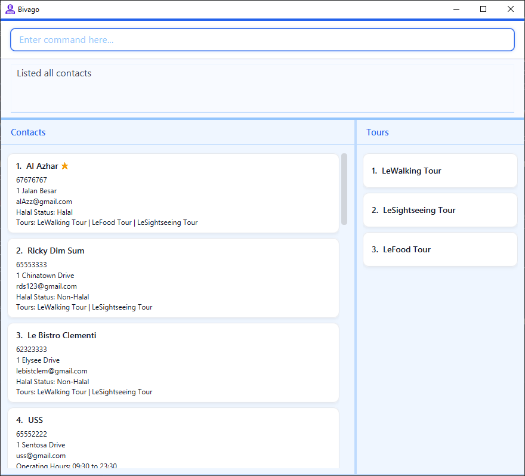
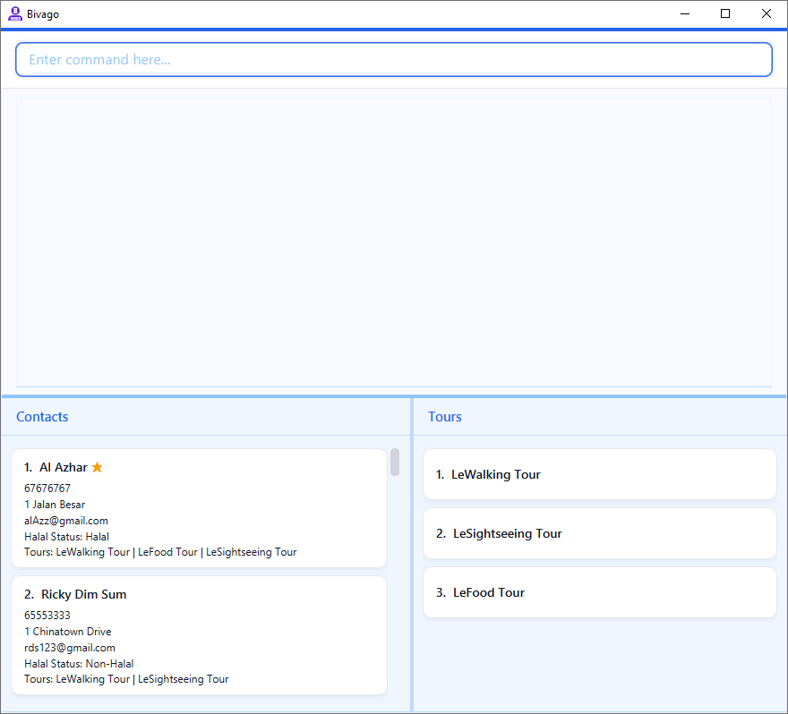

* Table of Contents
{:toc}

--------------------------------------------------------------------------------------------------------------------

## **Acknowledgements**

* {list here sources of all reused/adapted ideas, code, documentation, and third-party libraries -- include links to the original source as well}
* William: Usage of AI Tools (Open AI) to assist in extending tests to support different contact types and favourite contacts,
subsequently verified and tweaked accordingly. Namely in:
`FavouriteStatusTest.java`, `HalalStatusTest.java`,
`OpeningHourTest.java`, `ClosingHourTest.java`,
`AccommodationStarsTest.java`, `EditContactDescriptorTest.java`,
`FnbTest.java`, `AttractionTest.java`, `AccommodationTest.java`,
`ContactIsFavouritePredicateTest.java`, `FavouriteAddCommandTest.java`,
`FavouriteRemoveCommandTest.java`, `FavouriteViewCommandTest.java`,
`FavouriteAddCommandParserTest.java`, `FavouriteRemoveCommandParserTest.java`,
`EditCommandTest.java`, `AddCommandParserTest.java`
* William: Usage of AI Tools (Open AI) to assist in creating Plant UML diagrams which are subsequently verified and
tweaked to accurately reflect current implementation. Namely in: `ContactClassDiagram.puml`,
`EditContactDescriptorClassDiagram.puml`, `FavouriteAddSequenceDiagram.puml`, `FavouriteViewSequenceDiagram.puml`
* William: Usage of AI Tools (Open AI) as an extra layer of checks for bugs and typos.
* Chen Yoong Shee: Usage of AI Tools (Open AI) to assist in extending tests to support tour find and tour list command,
  subsequently verified and tweaked accordingly. Namely in:
  `TourFindCommandTest.java`, `TourFindCommandParserTest.java`
* Third party libraries/frameworks used: JavaFX, Jackson, JUnit 5

* Reiner: Usage of AI Tools (Claude) to assist in extending tests for tour assign, unassign, and view features, as well as their related test files. All AI-generated code was subsequently verified and tweaked to ensure correctness and consistency with the rest of the codebase. Namely in:
`TourAssignCommandTest.java`, `TourUnassignCommandTest.java`, `TourViewCommandTest.java`, `TourAssignCommandParserTest.java`, `TourUnassignCommandParserTest.java`, `TourViewCommandParserTest.java`
* Reiner: Usage of AI Tools (Claude) to assist in creating Plant UML diagrams which are subsequently verified and
tweaked to accurately reflect current implementation. Namely in: `TourAssignSequenceDiagram.puml`, `TourUnassignSequenceDiagram.puml`, `TourViewSequenceDiagram.puml`
* Reiner: Usage of AI Tools (Claude) as an extra layer of checks for bugs and typos.

--------------------------------------------------------------------------------------------------------------------

## **Setting up, getting started**

Refer to the guide [_Setting up and getting started_](SettingUp.md).

--------------------------------------------------------------------------------------------------------------------

## **Design**

:bulb: **Tip:** The `.puml` files used to create diagrams are in this document `docs/diagrams` folder. Refer to the [_PlantUML Tutorial_ at se-edu/guides](https://se-education.org/guides/tutorials/plantUml.html) to learn how to create and edit diagrams.

### Architecture

The ***Architecture Diagram*** given above explains the high-level design of the App.

Given below is a quick overview of main components and how they interact with each other.

**Main components of the architecture**

**`Main`** (consisting of classes [`Main`](https://github.com/se-edu/addressbook-level3/tree/master/src/main/java/seedu/address/Main.java) and [`MainApp`](https://github.com/se-edu/addressbook-level3/tree/master/src/main/java/seedu/address/MainApp.java)) is in charge of the app launch and shut down.
* At app launch, it initializes the other components in the correct sequence, and connects them up with each other.
* At shut down, it shuts down the other components and invokes cleanup methods where necessary.

The bulk of the app's work is done by the following four components:

* [**`UI`**](#ui-component): The UI of the App.
* [**`Logic`**](#logic-component): The command executor.
* [**`Model`**](#model-component): Holds the data of the App in memory.
* [**`Storage`**](#storage-component): Reads data from, and writes data to, the hard disk.

[**`Commons`**](#common-classes) represents a collection of classes used by multiple other components.

**How the architecture components interact with each other**

The *Sequence Diagram* below shows how the components interact with each other for the scenario where the user issues the command `delete 1`.

Each of the four main components (also shown in the diagram above),

* defines its *API* in an `interface` with the same name as the Component.
* implements its functionality using a concrete `{Component Name}Manager` class (which follows the corresponding API `interface` mentioned in the previous point.

For example, the `Logic` component defines its API in the `Logic.java` interface and implements its functionality using the `LogicManager.java` class which follows the `Logic` interface. Other components interact with a given component through its interface rather than the concrete class (reason: to prevent outside component's being coupled to the implementation of a component), as illustrated in the (partial) class diagram below.

The sections below give more details of each component.

### UI component

The **API** of this component is specified in [`Ui.java`](https://github.com/se-edu/addressbook-level3/tree/master/src/main/java/seedu/address/ui/Ui.java)

The UI consists of a `MainWindow` that is made up of parts e.g.`CommandBox`, `ResultDisplay`, `ContactListPanel`, `TourListPanel`, etc. All these, including the `MainWindow`, inherit from the abstract `UiPart` class which captures the commonalities between classes that represent parts of the visible GUI.

The `UI` component uses the JavaFx UI framework. The layout of these UI parts are defined in matching `.fxml` files that are in the `src/main/resources/view` folder. For example, the layout of the [`MainWindow`](https://github.com/se-edu/addressbook-level3/tree/master/src/main/java/seedu/address/ui/MainWindow.java) is specified in [`MainWindow.fxml`](https://github.com/se-edu/addressbook-level3/tree/master/src/main/resources/view/MainWindow.fxml)

The `UI` component,

* executes user commands using the `Logic` component.
* listens for changes to `Model` data so that the UI can be updated with the modified data.
* keeps a reference to the `Logic` component, because the `UI` relies on the `Logic` to execute commands.
* depends on some classes in the `Model` component, as it displays `Contact` and `Tour` objects residing in the `Model`.

### Logic component

**API** : [`Logic.java`](https://github.com/se-edu/addressbook-level3/tree/master/src/main/java/seedu/address/logic/Logic.java)

Here's a (partial) class diagram of the `Logic` component:

The sequence diagram below illustrates the interactions within the `Logic` component, taking `execute("delete 1")` API call as an example.

:information_source: **Note:** The lifeline for `DeleteCommandParser` should end at the destroy marker (X) but due to a limitation of PlantUML, the lifeline continues till the end of diagram.

How the `Logic` component works:

1. When `Logic` is called upon to execute a command, it is passed to an `AddressBookParser` object which in turn creates a parser that matches the command (e.g., `DeleteCommandParser`) and uses it to parse the command.
1. This results in a `Command` object (more precisely, an object of one of its subclasses e.g., `DeleteCommand`) which is executed by the `LogicManager`.
1. The command can communicate with the `Model` when it is executed (e.g. to delete a contact). 
   Note that although this is shown as a single step in the diagram above (for simplicity), in the code it can take several interactions (between the command object and the `Model`) to achieve.
1. The result of the command execution is encapsulated as a `CommandResult` object which is returned back from `Logic`.

Here are the other classes in `Logic` (omitted from the class diagram above) that are used for parsing a user command:

How the parsing works:
* When called upon to parse a user command, the `AddressBookParser` class creates an `XYZCommandParser` (`XYZ` is a placeholder for the specific command name e.g., `AddCommandParser`) which uses the other classes shown above to parse the user command and create a `XYZCommand` object (e.g., `AddCommand`) which the `AddressBookParser` returns back as a `Command` object.
* All `XYZCommandParser` classes (e.g., `AddCommandParser`, `DeleteCommandParser`, ...) inherit from the `Parser` interface so that they can be treated similarly where possible e.g, during testing.

### Model component
**API** : [`Model.java`](https://github.com/se-edu/addressbook-level3/tree/master/src/main/java/seedu/address/model/Model.java)

The `Model` component,

* stores the contact/tour data i.e., all `Contact`/`Tour` objects (which are contained in a `UniqueContactList`/`UniqueTourList` object).
* stores the currently 'selected' `Contact`/`Tour` objects (e.g., results of a search query) as separate _filtered_ lists which is exposed to outsiders as an unmodifiable `ObservableList<Contact>`/`ObservableList<Tour>` that can be 'observed' e.g. the UI can be bound to this list so that the UI automatically updates when the data in the list change.
* stores a `UserPref` object that represents the user’s preferences. This is exposed to the outside as a `ReadOnlyUserPref` objects.
* does not depend on any of the other three components (as the `Model` represents data entities of the domain, they should make sense on their own without depending on other components)

### Storage component

**API** : [`Storage.java`](https://github.com/se-edu/addressbook-level3/tree/master/src/main/java/seedu/address/storage/Storage.java)

The `Storage` component,
* can save both address book data and user preference data in JSON format, and read them back into corresponding objects.
* inherits from both `AddressBookStorage` and `UserPrefStorage`, which means it can be treated as either one (if only the functionality of only one is needed).
* depends on some classes in the `Model` component (because the `Storage` component's job is to save/retrieve objects that belong to the `Model`)
* validates each contact's type-specific fields on load — if a contact has fields irrelevant to its type (e.g. a `Person` with a `halalStatus` field), the entire data file is rejected and the app starts with an empty contact list.

### Common classes

Classes used by multiple components are in the `seedu.address.commons` package.

--------------------------------------------------------------------------------------------------------------------

## **Implementation**

This section describes some noteworthy details on how certain features are implemented.

### Multiple Contact Types

Bivago's content management currently supports four main types of contacts, represented by the `Person`, `Fnb`,
`Attraction`, and `Accommodation` classes. An abstract class `Contact` serves as the parent of these classes. `Person`
serves as the most basic contact type that preserves the same structure as in the AB3 implementation. Classes
`HalalStatus`, `OpeningHour`, `ClosingHour`, and `AccommodationStars` serve as wrapper classes (similar to `Name`,
`Address`, `Phone`, etc.) for the type-specific fields of each type of contact.

The code in the `Logic` component is updated to reflect the additional fields of the different contact types.
`EditContactDescriptor`, a nested class within `EditCommand` that is used to make changes to contacts, has been
extended to include these additional fields.

### Tour Packages

Bivago's content management supports the creation of tour packages, represented by `Tour` class. Each `Tour` is 
uniquely identified by its `Name`. The class `TourFavouriteStatus` serves as a wrapper class for the boolean state 
of the tour.

### Contact Favourites

Bivago also supports marking certain contacts as favourites, which is useful for managing important, commonly used,
or otherwise notable contacts. This is implemented using `FavouriteStatus`, a wrapper class containing a boolean value,
which is included in `Contact` as an additional field. New commands are introduced to manage favourites: adding contacts
to favourites, removing contacts from favourites, and viewing favourite contacts.

`FavouriteAddCommand` and `FavouriteRemoveCommand` perform a similar operation to `EditCommand`, making use of
`EditContactDescriptor` to change the `FavouriteStatus` of a `Contact`.

`FavouriteViewCommand` performs a similar operation to `FindCommand`, making use of a different predicate
`ContactIsFavouritePredicate` to filter only contacts whose `FavouriteStatus` is set to true.

### Tour Assignment Features

Bivago supports assigning and unassigning contacts to tour packages, as well as viewing all contacts assigned to a specific tour. These are implemented via three commands: `TourAssignCommand`, `TourUnassignCommand`, and `TourViewCommand`.

`TourAssignCommand` and `TourUnassignCommand` perform a similar operation to `EditCommand`, making use of `EditContactDescriptor` to update the set of `Tour` objects stored on a `Contact`. Both commands take two indices — a contact index and a tour index — resolve them against the currently displayed lists, validate the assignment state, then call `model.setContact()` followed by `model.commitAddressBook()` to persist the change.

`TourViewCommand` performs a similar operation to `FindCommand`, making use of `ContactIsInTourPredicate` to filter the contact list to only those assigned to the specified tour. The tour index is resolved against the currently displayed tour list, consistent with how other commands treat displayed indices.

### Undo/redo feature

#### Implementation

The undo/redo mechanism is facilitated by `VersionedAddressBook`. It extends `AddressBook` with an undo/redo history, stored internally as an `addressBookStateList` and `currentStatePointer`. Additionally, it implements the following operations:

* `VersionedAddressBook#commit()` — Saves a snapshot of the current address book state into its history.
* `VersionedAddressBook#undo()` — Restores the previous address book state from its history.
* `VersionedAddressBook#redo()` — Restores a previously undone address book state from its history.

These operations are exposed in the `Model` interface as `Model#commitAddressBook()`, `Model#undoAddressBook()` and `Model#redoAddressBook()` respectively.

Given below is an example usage scenario and how the undo/redo mechanism behaves at each step.

Step 1. The user launches the application for the first time. The `VersionedAddressBook` will be initialized with the initial address book state, and the `currentStatePointer` pointing to that single address book state.

Step 2. The user executes `delete 5` command to delete the 5th contact. The `delete` command calls `Model#commitAddressBook()`, causing a snapshot of the modified address book state to be saved in the `addressBookStateList`, and the `currentStatePointer` is shifted to the newly inserted state.

Step 3. The user executes `add type/person n/David …​` to add a new contact. The `add` command also calls `Model#commitAddressBook()`, causing another snapshot to be saved into the `addressBookStateList`.

:information_source: **Note:** If a command fails its execution, it will not call `Model#commitAddressBook()`, so the address book state will not be saved into the `addressBookStateList`.

Step 4. The user decides that adding the contact was a mistake and executes `undo`. The `undo` command calls `Model#undoAddressBook()`, which shifts the `currentStatePointer` once to the left and restores the address book to that state.

:information_source: **Note:** If the `currentStatePointer` is at index 0, pointing to the initial address book state, there are no previous states to restore. The `undo` command uses `Model#canUndoAddressBook()` to check for this case and returns an error to the user rather than attempting to undo.

The following sequence diagram shows how an undo operation goes through the `Logic` component:

:information_source: **Note:** The lifeline for `UndoCommand` should end at the destroy marker (X) but due to a limitation of PlantUML, the lifeline reaches the end of diagram.

Similarly, how an undo operation goes through the `Model` component is shown below:

The `redo` command does the opposite — it calls `Model#redoAddressBook()`, which shifts the `currentStatePointer` once to the right, pointing to the previously undone state, and restores the address book to that state.

:information_source: **Note:** If the `currentStatePointer` is at index `addressBookStateList.size() - 1`, pointing to the latest address book state, then there are no undone AddressBook states to restore. The `redo` command uses `Model#canRedoAddressBook()` to check if this is the case. If so, it will return an error to the user rather than attempting to perform the redo.

Step 5. The user then decides to execute the command `list`. Commands that do not modify the address book, such as `list`, will usually not call `Model#commitAddressBook()`, `Model#undoAddressBook()` or `Model#redoAddressBook()`. Thus, the `addressBookStateList` remains unchanged.

Step 6. The user executes `tour-delete 1`, which calls `Model#commitAddressBook()`. Since the `currentStatePointer` is not pointing at the end of the `addressBookStateList`, all address book states after the `currentStatePointer` will be purged. Reason: It no longer makes sense to redo the `add n/David …​` command. This is the behavior that most modern desktop applications follow.

The following activity diagram summarizes what happens when a user executes a new command:

#### Design considerations

**Aspect: How undo & redo executes:**

* **Alternative 1 (current choice):** Saves the entire address book as a snapshot.
  * Pros: Simple to implement and reason about; every command automatically supports undo/redo without extra logic.
  * Cons: Higher memory usage as each snapshot is a full copy of the address book.

* **Alternative 2:** Each command knows how to undo/redo itself.
  * Pros: Lower memory usage (e.g. for `delete`, only the deleted contact needs to be saved).
  * Cons: Every command must implement its own undo/redo logic, increasing implementation complexity and risk of bugs.

--------------------------------------------------------------------------------------------------------------------

## **Documentation, logging, testing, configuration, dev-ops**

* [Documentation guide](Documentation.md)
* [Testing guide](Testing.md)
* [Logging guide](Logging.md)
* [Configuration guide](Configuration.md)
* [DevOps guide](DevOps.md)

--------------------------------------------------------------------------------------------------------------------

## **Appendix: Requirements**

### Product scope

**Target user profile**

Bivago is designed for professional tour guides who:
* Manage a large network of contacts including drivers, restaurants, hotels, and attractions
* Prefer desktop applications with a Command-Line Interface (CLI) for fast, efficient data entry
* Need to quickly plan and organize tour packages by associating contacts with specific tours
* Conduct tours involving multiple service providers and need reliable, up-to-date contact records
* Are reasonably comfortable using CLI applications and can type quickly

**Value proposition**: manage contacts faster than a typical mouse/GUI driven app

### User stories

Priorities: High (must have) — `* * *`, Medium (nice to have) — `* *`, Low (unlikely to have) — `*`

| Priority | As a… | I want to… | So that I can… |
|----------|--------|------------|----------------|
| `* * *` | tour guide using the app for the first time | access a help page | learn how to use the app as a beginner |
| `* * *` | tour guide | add new contacts with their details | build my network of service providers within the app |
| `* * *` | tour guide | delete contacts I no longer work with | keep my contact list relevant |
| `* * *` | tour guide who is careless | have my contact data saved automatically | not lose information if the app closes |
| `* * *` | tour guide | create tour packages | organize my different tour offerings |
| `* * *` | tour guide | assign contacts to specific tours | know which driver, restaurant, and attractions are involved in each tour |
| `* * *` | tour guide who prioritizes efficiency | search through tours by criteria (e.g. category, contact, restaurant) | quickly find tours concerning certain contacts, restaurants, or categories |
| `* * *` | tour guide who is lazy and forgetful | see descriptive error messages when I input commands incorrectly | not have to keep referring to the help page |
| `* * *` | tour guide who conducts time-sensitive tours | store operating hours for restaurants and attractions | plan tours accordingly |
| `* * *` | tour guide who makes mistakes | undo and redo commands | revert accidental changes |
| `* *` | tour guide | add email addresses to contacts | communicate digitally when needed |
| `* *` | tour guide | categorize contacts by type (driver, restaurant, hotel, attraction) | quickly find the right person for each need |
| `* *` | tour guide | edit contact information | keep details up-to-date when phone numbers or addresses change or when I make a mistake |
| `* *` | tour guide | search for contacts by name | quickly find specific people |
| `* *` | tour guide | filter contacts by category | see all restaurants or all drivers at once |
| `* *` | tour guide | add pricing information to contacts | quickly estimate tour costs |
| `* *` | tour guide | store capacity information (e.g. restaurant seating, bus capacity) | match group sizes appropriately |
| `* *` | tour guide who conducts tours in other languages | add languages spoken by contacts (e.g. English-speaking driver, Mandarin-speaking restaurant staff) | match service providers with my international clients' needs |
| `* *` | tour guide | add notes to contacts | remember important details like dietary restrictions they accommodate or special pricing |
| `* *` | tour guide | mark favourite contacts | prioritize my most reliable service providers |
| `* *` | tour guide | view all contacts associated with a tour | see my full service provider lineup at a glance |
| `* *` | tour guide | tag tours by type (walking, food, sightseeing) | organize my offerings |
| `* *` | tour guide | add multiple restaurants to one tour | plan multi-stop food tours |
| `*` | tour guide | store multiple phone numbers for each contact | have backup contact methods |
| `*` | tour guide who is forgetful | set reminders for follow-ups with contacts | maintain relationships and confirm bookings ahead of tours |
| `*` | tour guide with affiliated contacts | link affiliated contacts (e.g. restaurant and nearby attraction) | remember partnership deals |
| `*` | tour guide with affiliated contacts | rate my affiliated contacts | track service quality over time |
| `*` | tour guide with affiliated contacts | add commission or discount information to contacts | remember special arrangements |
| `*` | tour guide who conducts tours in various locations | search contacts by location/neighbourhood | find service providers near specific attractions/location |
| `*` | tour guide who prioritizes efficiency | filter contacts by availability | quickly find who's available for a specific date |
| `*` | tour guide who conducts many tour packages | duplicate existing tours | quickly create similar tour packages without re-entering all details |
| `*` | tour guide who has wrist problems | alias commands I frequently use | not have to type so much |

---

### Use cases

*(For all use cases below, the **System** is `Bivago` and the **Actor** is the `tour guide`, unless specified otherwise)*

---

### Use Case: UC01 - View Help

**MSS**

1. User requests to view the help page.
2. Bivago displays a list of available commands and their usage.

*Use case ends.*

**Extensions**

- 1a. User enters an unrecognised command.
    - 1a1. Bivago shows an error message with a suggestion to use the help command.
    - 1a2. Use case ends.

---

### Use Case: UC02 - Add a New Contact

**MSS**
1. User requests to add a new contact with the relevant details.
2. Bivago saves the contact and confirms that the contact has been added.

*Use case ends.*

**Extensions**

- 1a. One or more required fields are missing or invalid.
    - 1a1. Bivago shows an error message indicating the missing or incorrect fields.
    - 1a2. Use case resumes at step 1.

- 1b. A contact with the same name already exists.
    - 1b1. Bivago shows a duplicate contact error message.
    - 1b2. Use case resumes at step 1.

---

### Use Case: UC03 - List All Contacts

**MSS**
1. User requests to list all contacts.
2. Bivago displays the full list of contacts.

*Use case ends.*

**Extensions**

- 2a. There are no contacts in Bivago.
    - 2a1. Bivago displays an empty list.
    - 2a2. Use case ends.

---

### Use Case: UC04 - Find Contacts

**MSS**
1. User requests to find contacts using a search query.
2. Bivago displays a list of contacts matching the search query.

*Use case ends.*

**Extensions**
- 1a. The search query is empty.
    - 1a1. Bivago shows an error message indicating that a search term must be provided.
    - 1a2. Use case resumes at step 1.

- 2a. No contacts match the search query.
    - 2a1. Bivago shows an error message indicating no contacts found.
    - 2a2. Use case ends.

---

### Use Case: UC05 - Edit a Contact's Details

**MSS**
1. User <u>finds the contact (UC03)</u>.
2. Bivago displays a list of matching contacts.
3. User requests to edit a specific contact using its index in the displayed list, providing the new field(s) to update.
4. Bivago saves and confirms the updated contact information.

*Use case ends.*

**Extensions**
- 3a. The given index is invalid.
    - 3a1. Bivago shows an error message.
    - 3a2. Use case resumes at step 3.

- 3b. The new value provided for a field is invalid.
    - 3b1. Bivago shows an error message.
    - 3b2. Use case resumes at step 3.

- 3c. No fields are provided to update.
    - 3c1. Bivago shows an error message.
    - 3c2. Use case resumes at step 3.

---

### Use Case: UC06 - Delete a Contact

**MSS**
1.  User requests to list contacts
2.  Bivago shows a list of contacts
3.  User requests to delete a specific contact in the list
4.  Bivago deletes the contact and confirms the deletion

*Use case ends.*

**Extensions**

- 2a. The list is empty.
    - 2a1. Use case ends.

- 3a. The given index is invalid.
    - 3a1. Bivago shows an error message.
    - 3a2. Use case resumes at step 2.

---

### Use Case: UC07 - Create a Tour Package

**MSS**
1. User requests to create a new tour package with a name.
2. Bivago confirms the tour has been created.

*Use case ends.*

**Extensions**

- 1a. A tour with the same name already exists.
    - 1a1. Bivago shows a duplicate tour name error.
    - 1a2. Use case resumes at step 1.

- 1b. The name provided is invalid.
    - 1b1. Bivago shows an error message.
    - 1b2. Use case resumes at step 1.

---

### Use Case: UC08 - Add a Contact to a Tour Package

**MSS**
1. User requests to assign a contact to a tour package.
2. Bivago confirms the contact has been assigned to the tour.

*Use case ends.*

**Extensions**
- 1a. The specified tour package does not exist.
    - 1a1. Bivago shows an error message.
    - 1a2. Use case ends.

- 1b. The specified contact does not exist.
    - 1b1. Bivago shows an error message.
    - 1b2. Use case ends.

- 1c. The specified contact is already assigned to the tour.
    - 1c1. Bivago shows a duplicate assignment error.
    - 1c2. Use case ends.

---

### Use Case: UC09 - Filter Contacts by Category

**MSS**

1. User requests to filter contacts by a specific category (e.g. restaurant).
2. Bivago displays all contacts belonging to that category.

*Use case ends.*

**Extensions**

- 2a. No contacts exist in the specified category.
    - 2a1. Bivago shows an empty list indicating no contacts were found in that category
    - 2a2. Use case ends.

---

### Use Case: UC10 - Add a Contact to Favourites

**MSS**
1. User requests to add a contact to favourites using its index in the displayed list.
2. Bivago marks the contact as a favourite.
3. Bivago confirms that the contact has been added to favourites.

*Use case ends.*

**Extensions**

- 1a. The given index is invalid.
    - 1a1. Bivago shows an error message.
    - 1a2. Use case resumes at step 1.

- 1b. The contact is already marked as a favourite.
    - 1b1. Bivago shows an error message indicating the contact is already in favourites.
    - 1b2. Use case resumes at step 1.

---

### Use Case: UC11 - Remove a Contact from favourites

**MSS**
1. User requests to remove a contact from favourites using its index in the displayed list.
2. Bivago unmarks the contact as a favourite.
3. Bivago confirms that the contact has been removed from favourites.

*Use case ends.*

**Extensions**

- 1a. The given index is invalid.
    - 1a1. Bivago shows an error message.
    - 1a2. Use case resumes at step 1.

- 1b. The contact is not marked as a favourite.
    - 1b1. Bivago shows an error message indicating the contact is not in favourites.
    - 1b2. Use case resumes at step 1.

---

### Use Case: UC12 - View favourite Contacts

**MSS**
1. User requests to view favourite contacts.
2. Bivago displays the list of contacts marked as favourites.

*Use case ends.*

**Extensions**

- 2a. There are no contacts marked as favourites.
    - 2a1. Bivago displays an empty list indicating no favourite contacts were found.
    - 2a2. Use case ends.

---

### Use Case: UC13 - Remove a Contact from a Tour Package

**MSS**
1. User requests to unassign a contact from a tour package.
2. Bivago removes the tour from the contact's tour list and confirms the contact has been unassigned from the tour.

*Use case ends.*

**Extensions**

- 1a. The specified tour package does not exist.
    - 1a1. Bivago shows an error message.
    - 1a2. Use case ends.

- 1b. The specified contact does not exist.
    - 1b1. Bivago shows an error message.
    - 1b2. Use case ends.

- 1c. The specified contact is not assigned to the tour.
    - 1c1. Bivago shows an error message indicating the contact is not in the tour.
    - 1c2. Use case ends.

---

### Use Case: UC14 - View Contacts in a Tour Package

**MSS**
1. User requests to view the contacts assigned to a specific tour package using its index.
2. Bivago displays all contacts assigned to that tour.

*Use case ends.*

**Extensions**

- 1a. The given index is invalid.
    - 1a1. Bivago shows an error message.
    - 1a2. Use case ends.

- 2a. No contacts are assigned to the tour.
    - 2a1. Bivago displays an empty list indicating no contacts are assigned to the tour.
    - 2a2. Use case ends.

---

### Use Case: UC15 - Duplicate a Tour Package

**MSS**
1. User requests to duplicate an existing tour package using its index, providing a new name.
2. Bivago creates a new tour with the given name and assigns all contacts from the original tour to it.
3. Bivago confirms the new tour has been created.

---

### Use Case: UC16 - Find Tour Package

**MSS**
1. User requests to find tour packages using a search query.
2. Bivago displays a list of tour packages matching the search query.

*Use case ends.*

**Extensions**
- 1a. The search query is empty.
    - 1a1. Bivago shows an error message indicating that a search term must be provided.
    - 1a2. Use case resumes at step 1.

- 2a. No tour packages match the search query.
    - 2a1. Bivago shows an error message indicating no tour packages found.
    - 2a2. Use case ends.

---

### Use Case: UC17 - List All Tour Packages

**MSS**
1. User requests to list all tour packages.
2. Bivago displays the full list of tour packages.

*Use case ends.*

**Extensions**

- 2a. There are no tour packages in Bivago.
    - 2a1. Bivago displays an empty list.
    - 2a2. Use case ends.

---

### Use Case: UC18 - Add a Tour Package to Favourite Tours

**MSS**
1. User requests to add a tour to favourite tours using its index in the displayed list.
2. Bivago marks the tour as a favourite.
3. Bivago confirms that the tour has been added to favourite tours.

*Use case ends.*

**Extensions**

- 1a. The given index is invalid.
    - 1a1. Bivago shows an error message.
    - 1a2. Use case resumes at step 1.

- 1b. The tour is already marked as a favourite.
    - 1b1. Bivago shows an error message indicating the tour is already in favourite tours.
    - 1b2. Use case resumes at step 1.

---

### Use Case: UC19 - Remove a Tour Package from Favourite Tours

**MSS**
1. User requests to remove a tour from favourite tours using its index in the displayed list.
2. Bivago unmarks the tour as a favourite.
3. Bivago confirms that the tour has been removed from favourite tours.

*Use case ends.*

**Extensions**

- 1a. The given index is invalid.
    - 1a1. Bivago shows an error message.
    - 1a2. Use case resumes at step 1.

- 1b. The tour is not marked as a favourite.
    - 1b1. Bivago shows an error message indicating the tour is not in favourite tours.
    - 1b2. Use case resumes at step 1.

---

### Use Case: UC20 - View Favourite Tours

**MSS**
1. User requests to view favourite tours.
2. Bivago displays the list of tours marked as favourites.

*Use case ends.*

**Extensions**

- 2a. There are no tours marked as favourites.
    - 2a1. Bivago displays an empty list indicating no favourite tours were found.
    - 2a2. Use case ends.

---

## Non-Functional Requirements

1. Should work on any mainstream OS (Windows, Linux, macOS) with Java 17 or above installed.
2. Should be able to hold up to 1000 contacts and 200 tour packages without noticeable performance degradation during typical usage.
3. A user with above-average typing speed for regular English text (i.e. not code, not system admin commands) should be able to complete most tasks faster using CLI commands than using the mouse.
4. The application should respond to any single user command within 2 seconds under normal operating conditions.
5. All contact and tour data must be persisted automatically after every command that modifies data, with no manual save step required.
6. The application must be packaged as a single portable JAR file requiring no installation beyond Java 17.
7. The application must function fully offline, with no dependence on external servers or internet connectivity.
8. The application should be usable by a tour guide with no prior experience of CLI applications after reading the help page.

---

### Glossary

| Term                             | Definition                                                                                                                                |
|----------------------------------|-------------------------------------------------------------------------------------------------------------------------------------------|
| **Mainstream OS**                | Windows, Linux, Unix, or macOS.                                                                                                           |
| **Contact**                      | A service provider in the tour guide's network, such as a driver, restaurant, hotel, or tourist attraction.                               |
| **Favourites**                   | A list of contacts chosen by the tour guide accessible by dedicated commands, each denoted by a star beside the name in the contact list. |
| **Tour Package**                 | A planned tour offering that groups together a set of contacts (e.g. driver, restaurants, attractions) under a named itinerary.           |
| **Category**                     | A classification label for contacts. Valid categories include: `person`, `fnb`, `accomm`, `attraction`.                                   |
| **Tag**                          | A label applied to a contact to store additional information, e.g. `driver`, `vip`.                                                       |
| **CLI (Command-Line Interface)** | A text-based interface where the user interacts with the application by typing commands rather than clicking buttons or menus.            |
| **favourite tours**              | A list of tours chosen by the tour guide accessible by dedicated commands, each denoted by a star beside the name in the tour list.       |

--------------------------------------------------------------------------------------------------------------------

## **Appendix: Instructions for manual testing**

Given below are instructions to test the app manually.

:information_source: **Note:** These instructions only provide a starting point for testers to work on;
testers are expected to do more *exploratory* testing.

### Launch and shutdown

1. Initial launch

   1. Download the jar file and copy into an empty folder

   1. Double-click the jar file 
       Expected: Shows the GUI with a set of sample contacts. The window size may not be optimum.

1. Saving window preferences

   1. Resize the window to an optimum size. Move the window to a different location. Close the window.

   1. Re-launch the app by double-clicking the jar file. 
       Expected: The most recent window size and location is retained.

1. Saving and loading

   1. Modify the app by using commands to add or delete tours and contacts.
   
   1. Close the window.

   1. Re-launch the app by double-clicking the jar file. 
      Expected: The modifications are still in effect.

### Adding a contact

1. Adding a new contact

    1. Prerequisites: None.

    1. Test case: `add type/person n/John Doe p/98765432 e/john@example.com a/123 Street t/driver` 
       Expected: Contact is added. Contact is added to the data file. Details of the added contact shown in the status message.

    1. Test case: Missing fields (e.g. `add n/John`) 
       Expected: Error message indicating missing required fields.

    1. Test case: Invalid fields (e.g. `add y/something type/person n/John Doe p/98765432 e/john@example.com a/123 Street t/driver`) 
       Expected: Error message indicating invalid command format.

    1. Test case: Duplicate contact 
       Expected: Error message indicating duplicate contact.

### Listing all contacts

1. Listing all contacts

    1. Prerequisites: None.

    1. Test case: `list` 
       Expected: All contacts are displayed in the contact list.

    1. Test case: `list` when there are no contacts 
       Expected: An empty list is shown.

### Editing a contact

1. Editing an existing contact

    1. Prerequisites: At least one contact exists.

    1. Test case: `edit 1 n/Jane Doe` 
       Expected: First contact’s name is updated. Contact details are updated in the data file.

    1. Test cases: Invalid fields (e.g. `edit`, `edit 0`, `edit a`) 
       Expected: Error message for invalid command format.

    1. Test case: Missing fields (e.g. `edit 1`) 
       Expected: Error message indicating no fields provided.

### Deleting a contact

1. Deleting a contact while all contacts are being shown

   1. Prerequisites: List all contacts using the `list` command. Multiple contacts in the list.

   1. Test case: `delete 1` 
      Expected: First contact in the overall contact list is deleted. Contact is removed from the data file. Details of the deleted contact shown in the status message.

   1. Test case: Missing fields (e.g. `delete`) 
      Expected: No contact is deleted. Error details shown in the status message. Status bar remains the same.

   1. Test case: Invalid fields (e.g. `delete 0`) 
      Expected: No contact is deleted. Error details shown in the status message. Status bar remains the same.

   1. Other incorrect delete commands to try: `delete`, `delete x`, `...` (where x is larger than the list size) 
      Expected: Similar to previous.

1. Deleting a contact from a filtered list

    1. Prerequisites: List all contacts using the `list` command. Use the `find` command to filter the list (e.g. `find n/John`).

    1. Test case: `delete 1` 
       Expected: First contact in the filtered list is deleted (not first contact in overall list). Contact is removed from the data file. Details of the deleted contact shown in the status message.

    1. Test case: `delete 2` (when only 1 result is shown) 
       Expected: No contact is deleted. Error details shown in the status message.

### Adding a contact to favourites

1. Adding a contact to favourites

    1. Prerequisites: At least one contact exists.

    1. Test case: `favourite-add 1` 
       Expected: Contact is marked as favourite (star appears in GUI). Contact details are updated in the data file.

    1. Test case: Missing fields (e.g. `favourite-add`) 
       Expected: Error message for invalid command format.

    1. Test case: Invalid fields (e.g. `favourite-add a`, `favourite-add 0`) 
       Expected: Error message for invalid command format.

    1. Test case: `favourite-add 1` (already favourite) 
       Expected: Error message indicating contact is already a favourite.

### Removing a contact from favourites

1. Removing a contact from favourites

    1. Prerequisites: At least one contact marked as favourite.

    1. Test case: `favourite-remove 1` 
       Expected: Contact is unmarked as favourite (star removed in GUI). Contact details are updated in the data file.

    1. Test case: Missing fields (e.g. `favourite-remove`) 
       Expected: Error message for invalid command format.

    1. Test case: Invalid fields (e.g. `favourite-remove a`, `favourite-remove 0`) 
       Expected: Error message for invalid command format.

    1. Test case: Removing non-favourite contact 
       Expected: Error message indicating contact is already not a favourite.

### Viewing favourite contacts

1. Viewing favourites

    1. Prerequisites: At least one contact marked as favourite.

    1. Test case: `favourite-view` 
       Expected: Only favourite contacts are displayed.

    1. Test case: No favourites exist 
       Expected: A message indicating 0 contacts listed.

### Duplicating a tour

1. Duplicating a tour

    1. Prerequisites: At least one tour exists. Use `tour-list` to confirm.

    1. Test case: `tour-duplicate 1 n/New Tour` 
       Expected: A new tour named `New Tour` is created with all contacts from the first tour assigned to it. Confirmation message shown.

    1. Test case: Duplicate name (e.g. name already exists as another tour) 
       Expected: Error message indicating duplicate tour name.

    1. Test case: Invalid index (e.g. `tour-duplicate 0 n/New Tour`) 
       Expected: Error message for invalid command format.

    1. Test case: Missing name prefix (e.g. `tour-duplicate 1`) 
       Expected: Error message for invalid command format.

### Assigning a contact to a tour

1. Assigning a contact to a tour

    1. Prerequisites: At least one contact and one tour exist.

    1. Test case: `tour-assign 1 tour/1` 
       Expected: First contact is assigned to the first tour. Confirmation message shown.

    1. Test case: Invalid contact index (e.g. `tour-assign 0 tour/1`) 
       Expected: Error message for invalid command format.

    1. Test case: Invalid tour index (e.g. `tour-assign 1 tour/0`) 
       Expected: Error message for invalid command format.

    1. Test case: Contact already assigned to the tour 
       Expected: Error message indicating duplicate assignment.

### Unassigning a contact from a tour

1. Unassigning a contact from a tour

    1. Prerequisites: At least one contact assigned to a tour.

    1. Test case: `tour-unassign 1 tour/1` 
       Expected: First contact is unassigned from the first tour. Confirmation message shown.

    1. Test case: Contact not assigned to the tour 
       Expected: Error message indicating contact is not in the tour.

    1. Test case: Invalid indices (e.g. `tour-unassign 0 tour/1`) 
       Expected: Error message for invalid command format.

### Listing all tours

1. Listing all tours

    1. Prerequisites: None.

    1. Test case: `tour-list` 
       Expected: All tours are displayed in the tour list.

    1. Test case: `tour-list` when there are no contacts 
       Expected: An empty list is shown.

### Viewing contacts in a tour

1. Viewing contacts assigned to a tour

    1. Prerequisites: At least one tour exists.

    1. Test case: `tour-view 1` 
       Expected: All contacts assigned to the first tour are displayed.

    1. Test case: `tour-view 1` when no contacts are assigned 
       Expected: Empty list is shown.

    1. Test case: Invalid index (e.g. `tour-view 0`) 
       Expected: Error message for invalid command format.

### Adding a tour to favourite tours

1. Adding a tour to favourite tours

    1. Prerequisites: At least one tour exists.

    1. Test case: `tour-favourite-add 1` 
       Expected: Tour is marked as favourite tours (star appears in GUI). Tour details are updated in the data file.

    1. Test case: Missing fields (e.g. `tour-favourite-add`) 
       Expected: Error message for invalid command format.

    1. Test case: Invalid fields (e.g. `tour-favourite-add a`, `tour-favourite-add 0`) 
       Expected: Error message for invalid command format.

    1. Test case: `tour-favourite-add 1` (already favourite) 
       Expected: Error message indicating tour is already a favourite tour.

### Removing a tour from favourite tour

1. Removing a tour from favourite tours

    1. Prerequisites: At least one tour marked as favourite tour.

    1. Test case: `tour-favourite-remove 1` 
       Expected: Tour is unmarked as favourite (star removed in GUI). Tour details are updated in the data file.

    1. Test case: Missing fields (e.g. `tour-favourite-remove`) 
       Expected: Error message for invalid command format.

    1. Test case: Invalid fields (e.g. `tour-favourite-remove a`, `tour-favourite-remove 0`) 
       Expected: Error message for invalid command format.

    1. Test case: Removing non-favourite tour 
       Expected: Error message indicating tour is already not a favourite.

### Viewing favourite tours

1. Viewing favourite tours

    1. Prerequisites: At least one tour marked as favourite tours.

    1. Test case: `tour-favourite-view` 
       Expected: Only favourite tours are displayed.

    1. Test case: No favourite tours exist 
       Expected: A message indicating 0 tour listed.

### Saving data

1. Dealing with missing/corrupted data files

   1. Prerequisites: `bivago-data.json` is present in the `data` folder.

   1. Test case: open `data/bivago-data.json` in a text editor and add an irrelevant field to a contact (e.g. add `"halalStatus": "true"` to a `Person` contact, or `"stars": "3"` to an `Fnb` contact). Save the file and relaunch the app.

      Expected: The app starts with an empty contact list. A warning message is shown in the result display stating the data file could not be loaded, the reason (e.g. which invalid field was detected), and that the app has started with a clean state. The corrupted `bivago-data.json` is immediately overwritten with an empty address book.

   1. Test case: delete `data/bivago-data.json` and relaunch the app.

      Expected: The app starts with the sample address book data and creates a new `bivago-data.json`.

## **Appendix: Effort**

### Difficulty & Challenges

1. Understanding the existing AB3 architecture had to be done at the start to get a surface-level understanding.
2. Deepening our understanding of AB3 had to be continuously done throughout the development process, as we write code that affects other components.
3. Features could not be developed in isolation because changes to the model, parser, or storage components often had project-wide impact, requiring extra care.
4. Increased complexity from supporting multiple contact types (Person, F&B, Attraction, Accommodation), each with distinct fields and constraints, with the original AB3 handles a single entity type Person
5. Designing and maintaining a polymorphic model structure with the contact types introduced additional complexity in inheritance, validation, and storage.
6. Parsing logic became more complex as commands needed to handle type-specific fields while remaining consistent in format and behavior.
7. Testing effort increased significantly due to:
   - Multiple contact types with different fields
   - Edge cases for missing/invalid inputs for type-specific fields
   - Ensuring correct serialization and deserialization of different types

### Effort & Achievements

1. Implemented a contact management solution with multiple types as well as a tour management solution, significantly extending the scope beyond AB3’s original design.
2. Designed and integrated a favourites feature that works across contacts and tours, implemented as a field without interfering with existing logic.
3. Updated the design of the UI to meet our solution's needs (both contact and tour management), as well as to reflect contacts or tours assigned as favourites.
4. Identified and resolved bugs early through continuous testing and integration, reducing technical debt downstream.

## **Appendix: Planned Enhancements**

Team size: 5

1. **Accept non-alphanumeric characters in names**: Currently, only alphanumeric characters are allowed to be entered in name fields. We plan to make the name field accept certain non-alphanumeric characters, including but not limited to `/`, `-`, `'`. This accounts for names which include `s/o`, `d/o`, and names such as `O'Brien`, `Jean-Pierre`.

2. **Accept non-English characters in names**: Currently, only alphanumeric characters are allowed to be entered in name fields. We plan to make the name field accept non-English characters, by accepting all Unicode characters classified as a letter. This accounts for names such as `Sergio Pérez`, `Nico Hülkenberg`.

3. **Enhance `find` command to search by any field**: Currently, the `find` command only supports searching by contact type and by name. We plan to make the `find` command more powerful by allowing users to search by any other field, such as email, phone number, address, halal status, opening/closing hours, and star rating.

4. **Enhance `find` command to match substrings**: Currently, the `find` command only matches against full words. We plan to make the `find` command more powerful by allowing users to specify whether to match against full words or match against substrings.

5. **Enhance email field validation**: Currently, the email field validation is on the more permissive side, as we do not want to reject unusual but valid emails. As such, some unusual but invalid emails might be accepted. We plan to improve the email validation to be closer to RFC compliant, so that invalid emails will be more likely to be caught.  
However, we would like to note that there are diminishing returns from strictly validating emails, and the foolproof method to validate emails is to actually send a test email.

6. **Accept duplicate names**: Currently, each contact is uniquely identified by its name. As such, users are not allowed to add a contact that shares a name with an existing contact, or edit a contact's name into one that is used by another existing contact. 
A workaround to this would be to add some additional text to the name, in order to disambiguate them. Some users may find this inconvenient, especially if they know a lot of people/entities with the same name.  
To remedy this, we plan to improve the flexibility of the app by identifying each contact using a combination of fields, such as name, phone, and email.

7. **Enhance phone number validation**: Currently, the validation for the phone number field is on the more permissive side, as we want to allow users to input additional information next to the phone number, or include the country code of the phone number. We also want to allow users to input multiple phone numbers in the same field. For example, we might expect the user to input `+65 6767 6767 (Office) | +65 9676 7676 (HP)`.  
However, this makes the parsing and validation of each phone number challenging, as it is difficult to anticipate how the user will format the phone numbers. We plan to strengthen the validation of phone numbers by restricting the format of the input field. For example, we may make the user specify 3 parameters for each phone number, which are the country code, the phone number itself, and additional remarks about the phone number.  
This stricter validation will limit the user to only be able to input one phone number per contact. We restore the ability to add multiple phone numbers per contact through the next planned enhancement.

8. **Allow multiple phone numbers in contacts**: Currently, we only provide a single phone number field per contact, which makes it difficult to validate phone number information. In order to support stronger validation, we plan to allow an arbitrary amount of phone number fields per contact. This can be implemented similarly to the tag system, where each contact can have multiple tags.  
By doing so, we can make the phone number data atomic for each contact, which in combination with the above planned enhancement, will give users the flexibility to add multiple phone numbers to each contact, while ensuring each phone number is properly validated.

9. **Record user preferences for window pane dividers**: Currently, the user preferences will record the overall window dimensions for the app. However, it will discard the changes the user made to the window pane dividers upon restart. For example, the user may have customised the dividers such that the console window pane and tour window pane are smaller. 
 
However, when the user closes and opens the app, the dividers are reset to their default configuration. 
 
We plan to make the app record the changes the user made to the dividers, and make these changes persistent across restarts.

10. **Indicate currently applied filters for contact and tour lists**: Currently, after using the `find`, `tour-find`, `tour-view`, `favourite-view`, `tour-favourite-view` commands which filters the view of the contact and tour lists, there is no indication that the lists were filtered. If the user wants to find out how the lists have been filtered, they will have to rely on their memory of the commands they last entered.  
To address this, we plan on adding an indicator which is always active, for each list, that tells the user what filters have been applied to the list. For example, if the last command which modified the contact list view was `find type/person`, the indicator would tell the user that the contact list is currently being filtered by `type/person`.
