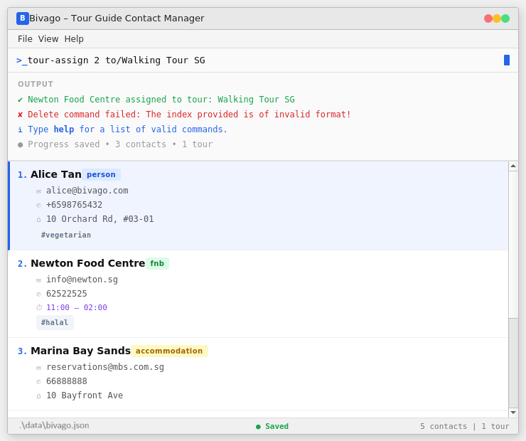

Bivago is a **desktop contact management app** meant for tour guides. Along with basic contact management, it also helps 
you **efficiently look up contacts** associated with the different tour packages that you offer. The app supports 
different types of contacts including **people, FnB establishments, accommodations and attractions**. Through 
consolidating your contacts and tours in a single application, Bivago helps you plan and execute better and smoother 
tours for your clients.

* Table of Contents
{:toc}

--------------------------------------------------------------------------------------------------------------------

## Quick start

1. Ensure you have Java `17` or above installed in your Computer. 
   **Mac users:** Ensure you have the precise JDK version prescribed 
[here](https://se-education.org/guides/tutorials/javaInstallationMac.html).

1. Download the latest `.jar` file from [here](https://github.com/AY2526S2-CS2103T-W08-1/tp/releases).

1. Copy the file to the folder you want to use as the _home folder_ for Bivago.

1. Open a command terminal, `cd` into the folder you put the jar file in, and use the `java -jar Bivago.jar` command to 
run the application. 
   A GUI similar to the below should appear in a few seconds. Note how the app contains some sample data. 
    (TO UPDATE IMAGE UPON CHANGES TO DEFAULT GUI)

1. Type the command in the command box and press Enter to execute it. e.g. typing **`help`** and pressing Enter will 
display the program usage instructions. 
   Some example commands you can try:

* `help` : Displays the help message.

* `list` : Lists all contacts.

* `add type/person n/John Doe p/98765432 e/johnd@example.com a/John street, block 123, #01-01` : Adds a contact
  named `John Doe` to the contact list.

* `tour-add n/City Walking Tour` : Adds a contact named `City Walking Tour` to the tour list.

* `delete 3` : Deletes the third contact shown in the current contact list.

* `exit` : Exits the app.

1. Refer to the [Features](#features) below for details of each command.

--------------------------------------------------------------------------------------------------------------------

## Features

**:information_source: Notes about the command format:** 

* Words in `UPPER_CASE` are the parameters to be supplied by the user. 
  e.g. in `add n/NAME`, `NAME` is a parameter which can be used as `add n/John Doe`.

* Items in square brackets are optional. 
  e.g `n/NAME [t/TAG]` can be used as `n/John Doe t/friend` or as `n/John Doe`.

* Items with `…`​ after them can be used multiple times including zero times. 
  e.g. `[t/TAG]…​` can be used as ` ` (i.e. 0 times), `t/friend`, `t/friend t/family` etc.

* Parameters can be in any order. 
  e.g. if the command specifies `n/NAME p/PHONE_NUMBER`, `p/PHONE_NUMBER n/NAME` is also acceptable.

* Extraneous parameters for commands that do not take in parameters (such as `help`, `list`, `exit` and `clear`) will 
be ignored. 
  e.g. if the command specifies `help 123`, it will be interpreted as `help`.

* If you are using a PDF version of this document, be careful when copying and pasting commands that span multiple lines 
as space characters surrounding line-breaks may be omitted when copied over to the application.

---

## General

### Viewing help : `help`

Shows a message explaining how to use the application.

Format: `help`

### Exiting the program : `exit`

Exits the program.

Format: `exit`

### Saving the data

Bivago data are saved in the hard disk automatically after any command that changes the data. There is no need to save
manually.

### Editing the data file

Bivago data are saved automatically as a JSON file `[JAR file location]/data/addressbook.json`. Advanced users are
welcome to update data directly by editing that data file.

:exclamation: **Caution:**
If your changes to the data file makes its format invalid, Bivago will discard all data and start with an empty data 
file at the next run. Hence, it is recommended to take a backup of the file before editing it. 
Furthermore, certain edits can cause the Bivago to behave in unexpected ways (e.g., if a value entered is outside of 
the acceptable range). Therefore, edit the data file only if you are confident that you can update it correctly.

---

## Contact Management

### Adding a contact: `add`

Adds a contact to the contact list.

Format:  
`add type/TYPE n/NAME p/PHONE e/EMAIL a/ADDRESS [h/HALAL_STATUS] [o/OPENING_HOUR] [c/CLOSING_HOUR] [s/STARS] [t/TAG]…​`

* Available types: `person`, `fnb`, `accommodation`, `attraction`
* Fields are type-specific:
    * **FnB contacts**: `[h/HALAL_STATUS]`
    * **Attraction contacts**: `[o/OPENING_HOUR] [c/CLOSING_HOUR]`
    * **Accommodation contacts**: `[s/STARS]`

:bulb: **Tip:**
A contact can have any number of tags (including 0)

**Field Constraints:**
* Halal Status must be `true` or `false` (default: `false`)
* Opening Hours must be in `HH:mm` 24-hour format (default: `08:00`)
* Closing Hours must be in `HH:mm` 24-hour format (default: `22:00`)
* Stars must be a single digit from `1–5` (default: `3`)

Examples:
* `add type/person n/John Doe p/98765432 e/johnd@example.com a/311 Clementi Ave 2`
* `add type/fnb n/Nasi Lemak Stall p/91234567 e/fnb@example.com a/Market Street h/true`
* `add type/attraction n/USS p/67891234 e/uss@example.com a/Sentosa o/09:00 c/21:00`
* `add type/accommodation n/Hotel 81 p/61234567 e/hotel@example.com a/Geylang s/4`

### Listing all contacts : `list`

Shows a list of all contacts in the contact list.

Format: `list`

### Editing a contact : `edit`

Edits an existing contact in the contact list.

Format:  
`edit INDEX [n/NAME] [p/PHONE] [e/EMAIL] [a/ADDRESS] [h/HALAL_STATUS] [o/OPENING_HOUR] [c/CLOSING_HOUR] [s/STARS] [t/TAG]…​`

* Edits the contact at the specified `INDEX`
* The index refers to the number shown in the displayed list
* The index **must be a positive integer** 1, 2, 3, …​
* At least one field must be provided
* Existing values will be overwritten
* When editing tags, existing tags are removed and replaced
* To remove all tags, use `t/` with no value

Examples:
* `edit 1 p/91234567 e/johndoe@example.com`
* `edit 2 n/New Name t/`

### Locating contacts by name: `find`

Finds contacts whose names contain any of the given keywords.

Format: `find KEYWORD [MORE_KEYWORDS]`

* Case-insensitive (e.g. `john` matches `John`)
* Order does not matter
* Only names are searched
* Matches full words only
* Returns contacts matching at least one keyword (OR search)

Examples:
* `find John`
* `find alex david`

### Deleting a contact : `delete`

Deletes the specified contact from the contact list.

Format: `delete INDEX`

* Deletes the contact at the specified `INDEX`
* Index must be a positive integer

Examples:
* `delete 2`
* `find John` followed by `delete 1`

---

## Tour Management

### Adding a tour: `tour-add`

Adds a tour package to the tour list.

Format: `tour-add n/NAME`

Examples:
* `tour-add n/Le Royal Tour`

### Listing tours: `tour-list`

Shows all available tour packages in the tour list.

Format: `tour-list`

### Assigning a tour: `tour-assign`

Assigns a tour to a contact.

Format: `tour-assign CONTACT_INDEX tour/TOUR_INDEX`

* Both indices must be positive integers

Examples:
* `tour-assign 1 tour/2`

### Viewing contacts in a tour: `tour-view`

Displays all contacts assigned to a specific tour.

Format: `tour-view INDEX`

Examples:
* `tour-view 1`

### Deleting a tour: `tour-delete`

Deletes a tour package from the tour list.

Format: `tour-delete INDEX`

Examples:
* `tour-delete 1`

---

## FAQ

**Q**: How do I transfer my data to another Computer? 
**A**: Install the app in the other computer and overwrite the empty data file it creates with the file that contains 
the data of your previous Bivago home folder.

--------------------------------------------------------------------------------------------------------------------

## Known issues

1. **When using multiple screens**, if you move the application to a secondary screen, and later switch to using only 
the primary screen, the GUI will open off-screen. The remedy is to delete the `preferences.json` file created by the 
application before running the application again.
2. **If you minimize the Help Window** and then run the `help` command (or use the `Help` menu, or the keyboard shortcut
`F1`) again, the original Help Window will remain minimized, and no new Help Window will appear. The remedy is to 
manually restore the minimized Help Window.

--------------------------------------------------------------------------------------------------------------------

## Command summary

### Contact Management

| Action       | Format, Examples |
|--------------|-----------------|
| **Add** | `add type/TYPE n/NAME p/PHONE e/EMAIL a/ADDRESS [h/HALAL_STATUS] [o/OPENING_HOUR] [c/CLOSING_HOUR] [s/STARS] [t/TAG]...`   e.g., `add type/person n/John Doe p/98765432 e/john@example.com a/311 Clementi Ave 2 t/friend` |
| **Delete** | `delete INDEX`   e.g., `delete 3` |
| **Edit** | `edit INDEX [n/NAME] [p/PHONE] [e/EMAIL] [a/ADDRESS] [h/HALAL_STATUS] [o/OPENING_HOUR] [c/CLOSING_HOUR] [s/STARS] [t/TAG]...`   e.g., `edit 2 p/91234567 e/john_new@example.com` |
| **Find** | `find KEYWORD [MORE_KEYWORDS]`   e.g., `find John Jane` |
| **List** | `list` |

### Tour Management

| Action | Format, Examples |
|--------|-----------------|
| **Add** | `tour-add n/NAME`   e.g., `tour-add n/Le Royal Tour` |
| **Delete** | `tour-delete INDEX`   e.g., `tour-delete 2` |
| **Assign** | `tour-assign CONTACT_INDEX tour/TOUR_INDEX`   e.g., `tour-assign 1 tour/2` |
| **View Contacts** | `tour-view INDEX`   e.g., `tour-view 1` |
| **List** | `tour-list` |

### Miscellaneous

| Action | Format, Examples |
|--------|-----------------|
| **Help** | `help` |
| **Exit** | `exit` |