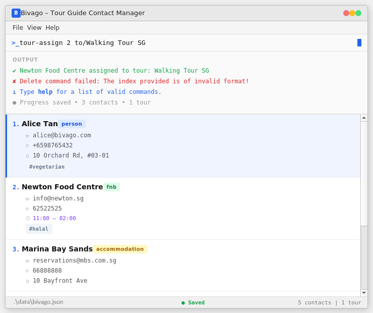

Bivago is a **desktop contact management app** meant for tour guides. Along with basic contact management, it also helps
you **efficiently look up contacts** associated with the different tour packages that you offer. The app supports
different types of contacts including **people, F&B establishments, accommodations and attractions**. Through
consolidating your contacts and tours in a simple **Command Line Interface (CLI)** application, Bivago helps you plan
and execute better and smoother tours for your clients.

* Table of Contents
{:toc}

---

## How it serves you

Bivago provides two main components:
* Contact Management
* Tour Management

### Contact Management
Through Contact Management, you can **store different types of contacts** you work with. You can store contacts for
people (e.g. drivers, shop owners), F&B establishments (e.g. street food vendors, restaurants), attractions (e.g.
museums, amusement parks) and accommodation (e.g. hotels, hostels). For each type of contact, they come with additional
 information relevant to that type such as Halal status, operating hours, and stars. Tags are also available for you
 to store any additional information.

### Tour Management
Through Tour Management, you can **store different tour packages** you offer and assign contacts with those tours.
When planning to conduct a specific tour, you can see the assigned contacts at a glance and with the relevant
information from the contacts, you can make informed decisions during tour planning. You can also benefit from tour
management while conducting the tour as you can quickly view contact details on the day itself and contact them.

## Quick start

1. Ensure you have `Java 17` or above installed in your Computer. 
**Windows users:** Follow the installation instructions [here](https://se-education.org/guides/tutorials/javaInstallationWindows.html). 
**Mac users:** Follow the installation instructions [here](https://se-education.org/guides/tutorials/javaInstallationMac.html). 
**Linux users:** Follow the installation instructions [here](https://se-education.org/guides/tutorials/javaInstallationLinux.html). 

2. Download the latest `.jar` file from [here](https://github.com/AY2526S2-CS2103T-W08-1/tp/releases).

3. Open a command terminal. 
**Windows users:** Press `Win + R`, type `cmd` and press `Enter`. 
**Mac users:** Press `Cmd + Space`, type `Terminal` and press `Enter`. 
**Linux users:** Open Terminal from your applications menu. 

4. Copy the file to the folder you want to use as the _home folder_ for Bivago. 
**Windows users:** Type `copy Bivago.jar FILEPATH` and press `Enter`. 
**Mac/Linux users:** Type `cp Bivago.jar FILEPATH` and press `Enter`. 

5. Type `cd FILEPATH` and press `Enter` to navigate to the folder you put the jar file in.

6. Type `java -jar Bivago.jar` command and press `Enter` to run the application. 
   A window similar to the below should appear in a few seconds. Note how the app contains some sample data. 
   

7. Type a command in the command box and press `Enter` to execute it. e.g. typing `help` and pressing `Enter` will
   display the program usage instructions. 
   Some example commands you can try:

* `help` : Displays the help message.

* `list` : Lists all contacts.

* `add type/person n/John Doe p/98765432 e/johnd@example.com a/John street, block 123, #01-01` : Adds a contact
  named `John Doe` to the contact list.

* `tour-add n/City Walking Tour` : Adds a tour named `City Walking Tour` to the tour list.

* `delete 3` : Deletes the third contact shown in the current contact list.

* `exit` : Exits the app.

Refer to the [Features](#features) below for details of each command.

---

## Features

**:information_source: Notes about the command format:** 

* Words in `UPPER_CASE` are the parameters to be supplied by the user. 
  e.g. in `add n/NAME`, `NAME` is a parameter which can be used as `add n/John Doe`.

* Items in square brackets are optional. 
  e.g. `n/NAME [t/TAG]` can be used as `n/John Doe t/friend` or as `n/John Doe`.

* Items with `…`​ after them can be used multiple times including zero times. 
  e.g. `[t/TAG]…​` can be used as ` ` (i.e. 0 times), `t/friend`, `t/friend t/family` etc.

* Parameters can be in any order. 
  e.g. the parameters `n/NAME p/PHONE_NUMBER` and `p/PHONE_NUMBER n/NAME` are equivalent.

* Extraneous parameters for commands that do not take in parameters (such as `help`, `list`, `exit` and `clear`) 
  will be ignored. 
  e.g. if the command specifies `help 123`, it will be interpreted as `help`.
* Parameters not specific to the contact type will cause the command to be rejected with an error message shown to 
  the user. 
  e.g. the parameter `h/HALAL_STATUS` is not applicable to a `type/person` contact, the add command will be rejected 
  until a correction is made.

* If you are using a PDF version of this document, be careful when copying and pasting commands that span multiple lines
  as space characters surrounding line-breaks may be omitted when copied over to the application.

---

## General

### Viewing help : `help`

Shows a message explaining how to use the application.

**Format:** `help`

### Exiting the program : `exit`

Exits the program.

**Format:** `exit`

### Clearing the app : `clear`

Clears all data from the app.

**Format:** `clear`

### Undoing the last command: `undo`

Undoes the previous command.

* Commands which do not modify contacts/tours will not be considered
* There must be at least one command that modifies contacts/tours in the command history to be undone
* Multiple `undo` commands can be done in a row, as long as there are commands to undo

<b>Example:</b>

<ul>
  <li><code>delete 1</code> followed by <code>undo</code>:
  Restores the first contact that was deleted by the <code>delete</code> command.</li>

  <li><code>tour-add n/LeGoated Tour</code> followed by <code>list</code> followed by <code>undo</code> :
  Deletes the tour named <code>LeGoated Tour</code> from the tour list. Note that the <code>list</code> command was ignored by the <code>undo</code> command.</li>

  <li><code>delete 1</code> followed by <code>tour-delete 1</code> followed by <code>undo</code> followed by  <code>undo</code>:
  Restores the first contact and the first tour that was deleted by the <code>delete</code> command and the <code>tour-delete</code> command.</li>
</ul>

### Redoing an undone command: `redo`

Redoes what was undone by an `undo` command.

* Commands which do not modify contacts/tours will not be considered
* There must be at least one undone command in the command history to be redone
* Multiple `redo` commands can be done in a row, as long as there are commands to redo
* If a command which modifies contacts/tours is done after an `undo` command, the redo history will be cleared. This means that the undone command can no longer be redone.

<b>Example:</b>

<ul>
  <li><code>delete 1</code> followed by <code>undo</code> followed by <code>redo</code> :
  Deletes the first contact that was restored by the <code>undo</code> command.</li>

  <li><code>tour-add n/LeGoated Tour</code> followed by <code>list</code> followed by <code>undo</code> followed by <code>redo</code> :
  Restores the tour named <code>LeGoated Tour</code> that was deleted by the <code>undo</code> command. Note that the <code>list</code> command was ignored by the <code>redo</code> command.</li>

  <li><code>delete 1</code> followed by <code>undo</code> followed by <code>delete 2</code> followed by <code>redo</code> :
  Restores the first contact that was deleted by the <code>delete</code> command, then deletes the second contact. Note that the final <code>redo</code> command will result in an error, since the second <code>delete</code> command has erased the <code>undo</code> command from history.</li>
</ul>

### Saving the data

Bivago data are saved in the hard disk automatically after any command that changes the data. There is no need to save
manually.

### Editing the data file

Bivago data are saved automatically as a JSON file `[JAR file location]/data/bivago-data.json`. Advanced users are welcome to update data by directly editing that data file.

:exclamation: **Caution:**
If your changes to the data file makes its format invalid, or make certain values invalid, Bivago will discard all data and start with an empty data file at the next run. Hence, it is recommended to make a backup of a file before editing it.

---

## Contact Management

### Adding a contact: `add`

Adds a contact to the contact list.

**Format:**
`add type/TYPE n/NAME p/PHONE e/EMAIL a/ADDRESS [h/HALAL_STATUS] [o/OPENING_HOUR] [c/CLOSING_HOUR]
 [s/STARS] [t/TAG]…​`

:bulb: **Tip:**
A contact can have any number of tags (including 0). Each tag must be at most 30 characters long.

**General Fields & Constraints**
* `type/TYPE` — must be `person`, `fnb`, `accomm`, or `attraction`
* `n/NAME` — only alphanumeric characters and spaces allowed, and cannot be blank
* `p/PHONE` — must contain at least 3 digits; may also include letters, parentheses `()`, spaces, `+`, and `|` to add country codes, labels, or multiple numbers (e.g. `+6581231231` or `81231231(House) | 1241242(Personal)`)
* `e/EMAIL` — a valid email in the form `LOCAL-PART@DOMAIN`
* `a/ADDRESS` — cannot be blank
* `t/TAG` — only alphanumeric characters allowed, and must be at most 30 characters long
* Invalid data in any field will cause the command to be rejected

<b>Valid Email Rules:</b>

<ul>
  <li>Emails should be in the form <code>LOCAL-PART@DOMAIN</code>.</li>

  <li><code>LOCAL-PART</code> must contain only alphanumeric characters, and the following special characters: <code>+_.-</code>.</li>
  <ul>
    <li><code>LOCAL-PART</code> must not start or end with any special characters.</li>
  </ul>

  <li><code>DOMAIN</code> is made up of domain labels, which are separated by periods.</li>

  <ul>
    <li><code>DOMAIN</code> must end with a domain label containing at least 2 characters.</li>
    <li>Each domain label must contain only alphanumeric characters, or hyphens.</li>
    <li>Each domain label must start and end with alphanumeric characters.</li>
  </ul>

</ul>

 

**Type-specific Fields & Constraints**

* **F&B contacts**: `[h/HALAL_STATUS]` — must be `true` or `false` (default: `false`)
* **Attraction contacts**: `[o/OPENING_HOUR] [c/CLOSING_HOUR]` — format `HH:mm` (default: `08:00`–`22:00`)
* **Accommodation contacts**: `[s/STARS]` — must be `1–5` (default: `3`)

:exclamation: **Important:**
Having fields that are not applicable to the specified contact type will cause the command to be rejected.
For example, `h/true` will not apply to `person` contacts.

:information_source: **Note:**
A warning is shown if the new contact's phone, email, or address matches another existing contact. The contact is still added — the warning is informational only.

<b>Example:</b>

<ul>
  <li><code>add type/person n/John Doe p/98765432 e/johnd@example.com a/311 Clementi Ave 2</code> :
  Adds a person contact named <code>John Doe</code> to the contact list. 
  </li>

  <li><code>add type/fnb n/Nasi Lemak Stall p/91234567 e/fnb@example.com a/Market Street h/true</code> :
  Adds an F&amp;B contact named <code>Nasi Lemak Stall</code> with halal status set to <code>true</code>.</li>

  <li><code>add type/attraction n/USS p/67891234 e/uss@example.com a/Sentosa o/09:00 c/21:00</code> :
  Adds an attraction named <code>USS</code> with operating hours from <code>09:00</code> to <code>21:00</code>.</li>

  <li><code>add type/accomm n/Hotel 81 p/61234567 e/hotel@example.com a/Geylang s/4</code> :
  Adds an accommodation named <code>Hotel 81</code> with a <code>4</code>-star rating.</li>
</ul>

### Listing all contacts : `list`

Shows a list of all contacts in the contact list.

**Format:** `list`

### Editing a contact : `edit`

Edits an existing contact in the contact list.

**Format:**
`edit INDEX [n/NAME] [p/PHONE] [e/EMAIL] [a/ADDRESS] [h/HALAL_STATUS] [o/OPENING_HOUR] [c/CLOSING_HOUR] [s/STARS] [t/TAG]…​`

* Edits the contact at the specified `INDEX`
* The index refers to the number shown in the displayed list
* The index **must be a positive integer** 1, 2, 3, …​
* At least one field must be provided
* Existing values will be overwritten
* When editing tags, existing tags are removed and replaced
* To remove all tags, use `t/` with no value
* The edit is rejected if the new values are identical to the existing contact (no actual change)
* A warning is shown if the edited phone, email, or address matches another contact

<b>Example:</b>

<ul>
  <li><code>edit 1 p/91234567 e/alAhh@example.com</code> :
  Edits the first contact by updating the phone number and email. 
  </li>

  <li><code>edit 1 p/91234567(Mobile) | 61234567(Office)</code> :
  Edits the first contact with multiple labelled phone numbers.</li>

  <li><code>edit 2 n/New Name t/</code> :
  Edits the second contact by updating the name and clearing all tags.</li>
</ul>

### Searching contacts by name: `find`

Finds contacts matching a specified type, whose names contain any of the given keywords.

**Format:** `find [type/TYPE] [n/KEYWORD [MORE KEYWORDS]]`

* Either `type/TYPE` or `n/KEYWORD` must be specified
* `type/TYPE` being omitted means any type of contacts is included
* `n/KEYWORD` being omitted means all contacts of the specified type are included
* Keywords are case-insensitive (e.g. `john` matches `John`)
* Order does not matter
* Only names are searched
* Matches **full words only**
* Returns contacts matching at least one keyword (OR search)

<b>Example:</b>

<ul>
  <li><code>find n/John</code> :
  Finds contacts of any type whose names contain <code>John</code>. 
  </li>

  <li><code>find n/alex david</code> :
  Finds contacts of any type whose names contain <code>alex</code> or <code>david</code>.</li>

  <li><code>find type/fnb</code> :
  Finds contacts of type <code>fnb</code>.</li>

  <li><code>find type/attraction n/NUS NTU</code> :
  Finds contacts of type <code>attraction</code> whose name contain <code>NUS</code> or <code>NTU</code>.</li>
</ul>

### Deleting a contact : `delete`

Deletes the specified contact from the contact list.

**Format:** `delete INDEX`

* Deletes the contact at the specified `INDEX`
* Index must be a positive integer

<b>Example:</b>

<ul>
  <li><code>delete 2</code> :
  Deletes the second contact shown in the current contact list.</li>

  <li><code>find n/John</code> followed by <code>delete 1</code> :
  Deletes the first contact from the filtered results.</li>
</ul>

### Adding contacts to favourites: `favourite-add`

Adds a specified contact from the contact list as a favourite contact.

**Format:** `favourite-add INDEX`

* Adds the contact at the specified `INDEX` as a favourite contact.
* Index must be a positive integer

<b>Example:</b>

<ul>
  <li><code>favourite-add 2</code> :
  Adds the second contact shown in the current contact list as a favourite contact. 
  </li>
</ul>

### Viewing favourite contacts: `favourite-view`

Shows a list of all favourite contacts in the contact list.

**Format:** `favourite-view`

### Removing contacts from favourites: `favourite-remove`

Removes a specified contact as a favourite contact.

**Format:** `favourite-remove INDEX`

* Removes the contact at the specified `INDEX` as a favourite contact.
* Index must be a positive integer

<b>Example:</b>

<ul>
  <li><code>favourite-remove 1</code> :
  Removes the first contact shown in the current contact list as a favourite contact.</li>
</ul>

---

## Tour Management

### Adding a tour: `tour-add`

Adds a tour package to the tour list.

**Format:** `tour-add n/NAME`

<b>Example:</b>

<ul>
  <li><code>tour-add n/Le Royal Tour</code> :
  Adds a tour named <code>Le Royal Tour</code>. 
  </li>
</ul>

### Listing tours: `tour-list`

Shows all available tours in the tour list.

**Format:** `tour-list`

### Assigning a tour: `tour-assign`

Assigns a contact to a tour.

**Format:** `tour-assign CONTACT_INDEX tour/TOUR_INDEX`

* Both indices must be positive integers

<b>Example:</b>

<ul>
  <li><code>tour-assign 1 tour/3</code> :
  Assigns the first contact to the third tour. 
  </li>
</ul>

### Unassigning a tour: `tour-unassign`

Unassigns a contact from a tour.

**Format:** `tour-unassign CONTACT_INDEX tour/TOUR_INDEX`

* Both indices must be positive integers

<b>Example:</b>

<ul>
  <li><code>tour-unassign 3 tour/5</code> :
  Unassigns the third contact from the fifth tour.</li>
</ul>

### Viewing a tour: `tour-view`

Displays all contacts assigned to a specified tour.

**Format:** `tour-view INDEX`

<b>Example:</b>

<ul>
  <li><code>tour-view 1</code> :
  Displays all contacts assigned to the first tour.</li>
</ul>

### Searching tours by name: `tour-find`

Finds tours whose names contain any of the given keywords.

**Format:** `tour-find KEYWORD [MORE_KEYWORDS]`

* Case-insensitive (e.g. `foodie` matches `Foodie`)
* Order does not matter
* Only names are searched
* Matches **full words only**
* Returns tours matching at least one keyword (OR search)

<b>Example:</b>

<ul>
  <li><code>tour-find Foodie</code> :
  Finds tours whose names contain <code>Foodie</code>.</li>

  <li><code>tour-find LeWalking Royal</code> :
  Finds tours whose names contain <code>LeWalking</code> or <code>Royal</code>. 
  </li>
</ul>

### Deleting a tour: `tour-delete`

Deletes a tour package from the tour list.

**Format:** `tour-delete INDEX`

<b>Example:</b>

<ul>
  <li><code>tour-delete 1</code> :
  Deletes the first tour in the current tour list.</li>
</ul>

### Duplicating a tour: `tour-duplicate`

Creates a new tour with a specified name, and assigns all contacts from an existing tour to it.

**Format:** `tour-duplicate INDEX n/NAME`

* Duplicates the tour at the specified `INDEX`
* Index must be a positive integer
* `NAME` must not already exist as a tour

<b>Example:</b>

<ul>
  <li><code>tour-duplicate 1 n/Le Royal Tour Copy</code>:
  Creates a new tour named <code>Le Royal Tour Copy</code> with all contacts from the first tour assigned to 
it. </li>
</ul>

### Adding tours to favourites: `tour-favourite-add`

Adds a specified tour from the tour list as a favourite tour.

**Format:** `tour-favourite-add INDEX`

* Adds the tour at the specified `INDEX` as a favourite tour.
* Index must be a positive integer

<b>Example:</b>

<ul>
  <li><code>tour-favourite-add 2</code> :
  Adds the second tour shown in the current tour list as a favourite tour. 
  </li>
</ul>

### Viewing favourite tours: `tour-favourite-view`

Shows a list of all favourite tours in the tour list.

**Format:** `tour-favourite-view`

### Removing tours from favourites: `tour-favourite-remove`

Removes a specified tour as a favourite tour.

**Format:** `tour-favourite-remove INDEX`

* Removes the tour at the specified `INDEX` as a favourite tour.
* Index must be a positive integer

<b>Example:</b>

<ul>
  <li><code>tour-favourite-remove 1</code> :
  Removes the first tour shown in the current tour list as a favourite tour.</li>
</ul>

---

## Known issues

1. **When using multiple screens**, if you move the application to a secondary screen, and later switch to using only
   the primary screen, the GUI will open off-screen. The remedy is to delete the `preferences.json` file created by the
   application before running the application again.

---

## Command summary

### General

| Action    | Command | Summary                    |
|-----------|---------|----------------------------|
| **Help**  | `help`  | Displays a help message    |
| **Exit**  | `exit`  | Closes the program         |
| **Clear** | `clear` | Clears all data            |
| **Undo**  | `undo`  | Undo the previous command  |
| **Redo**  | `redo`  | Restores an undone command |

### Contact Management

| Action               | Command                                                                                                                                                                                                                     | Summary                                 |
|----------------------|-----------------------------------------------------------------------------------------------------------------------------------------------------------------------------------------------------------------------------|-----------------------------------------|
| **Add**              | `add type/TYPE n/NAME p/PHONE e/EMAIL a/ADDRESS [h/HALAL_STATUS] [o/OPENING_HOUR] [c/CLOSING_HOUR] [s/STARS] [t/TAG]…​`   e.g., `add type/person n/John Doe p/98765432 e/john@example.com a/311 Clementi Ave 2 t/friend` | Adds a contact to the contact list      |
| **Delete**           | `delete INDEX`   e.g., `delete 3`    | Deletes a contact from the contact list |
| **Edit**             | `edit INDEX [n/NAME] [p/PHONE] [e/EMAIL] [a/ADDRESS] [h/HALAL_STATUS] [o/OPENING_HOUR] [c/CLOSING_HOUR] [s/STARS] [t/TAG]…​`   e.g., `edit 2 p/91234567 e/john_new@example.com`                 | Edits a contact in contact list         |
| **Find**             | `find [type/TYPE] [n/KEYWORD [MORE_KEYWORDS]…​]`   e.g., `find type/person n/John Jane` | Filters the contact list                |
| **List**             | `list`       | Lists all contacts                      |
| **Favourite Add**    | `favourite-add INDEX`   e.g., `favourite-add 1` | Adds a contact to favourites            |
| **Favourite View**   | `favourite-view` | Displays favourite contacts             |
| **Favourite Remove** | `favourite-remove INDEX`   e.g., `favourite-remove 2` | Removes a contact from favourites       |

### Tour Management

| Action                    | Command                                                                           | Summary                                                |
|---------------------------|-----------------------------------------------------------------------------------|--------------------------------------------------------|
| **Add**                   | `tour-add n/NAME`   e.g., `tour-add n/Le Royal Tour`                           | Adds a tour to the tour list                           |
| **Delete**                | `tour-delete INDEX`   e.g., `tour-delete 2`                                    | Deletes a tour from the tour list                      |
| **Assign**                | `tour-assign CONTACT_INDEX tour/TOUR_INDEX`   e.g., `tour-assign 1 tour/2`     | Assigns a contact to a tour                            |
| **Unassign**              | `tour-unassign CONTACT_INDEX tour/TOUR_INDEX`   e.g., `tour-unassign 3 tour/5` | Unassigns a contact from a tour                        |
| **View**                  | `tour-view INDEX`   e.g., `tour-view 1`                                        | Display contacts assigned to a tour                    |
| **Find**                  | `tour-find KEYWORD [MORE_KEYWORDS]`   e.g., `tour-find City Walking`           | Filters the tour list                                  |
| **List**                  | `tour-list`                                                                       | Lists all tours                                        |
| **Tour Favourite Add**    | `tour-favourite-add INDEX`   e.g., `tour-favourite-add 1`                      | Adds a tour to favourites                              |
| **Tour Favourite View**   | `tour-favourite-view`                                                             | Displays favourite tours                               |
| **Tour Favourite Remove** | `tour-favourite-remove INDEX`   e.g., `tour-favourite-remove 2`                | Removes a tour from favourites                         |
| **Tour Duplicate**        | `tour-duplicate INDEX n/NAME`   e.g., `tour-duplicate 1 n/Le Chantilly Tour`   | Duplicates content of an existing tour with a new name |
